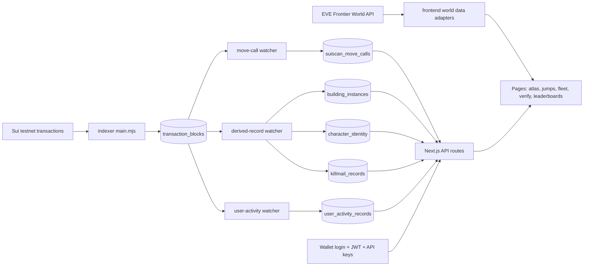
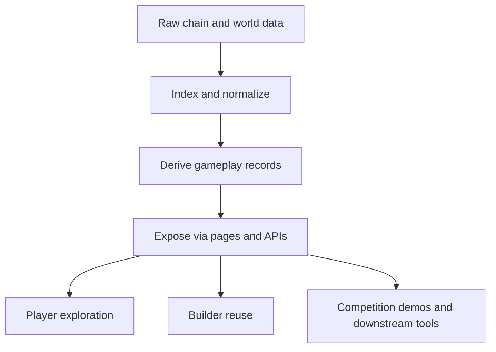

# EVE EYES

EVE EYES is an open-source on-chain intelligence console for the EVE Frontier ecosystem. It turns raw Sui activity and World API data into a product-ready surface for players, builders, and hackathon teams: searchable records, route intelligence, verifiable world data, wallet-gated access, and reusable APIs.

[Live Product](https://eve-eyes.d0v.xyz/)

[中文版本](./README.zh-CN.md)

## Product Positioning

EVE EYES is an on-chain game data indexer and intelligence layer for EVE Frontier.

It sits between raw blockchain activity and downstream game products. Instead of asking teams to parse transactions, infer state changes, and build their own query surfaces from scratch, EVE EYES turns chain activity into structured gameplay data, operator views, and reusable APIs.

In one line:

> EVE EYES is a competition-ready on-chain game data indexer, intelligence console, and API layer for EVE Frontier.

## What Problem We Solve

Many on-chain game projects run into the same bottleneck:

- game data is public, but hard to use in a product workflow
- raw transactions are technically visible, but not readable for most users
- hackathon teams spend too much time cleaning data before building ideas
- demos often stop at presentation, without reusable infrastructure

EVE EYES solves this by turning raw on-chain activity into an operational product with UI, indexed storage, derived records, and APIs.

Players, designers, and builders do not want raw chain logs. They want actionable gameplay information:

- Where can I go?
- What changed in the world?
- Who owns what?
- What happened in combat or construction?
- Can I trust the data and share it?

EVE EYES answers those needs through route planning, atlas exploration, indexed move-call history, building leaderboards, killmail records, POD verification, wallet identity, and API-based reuse.

## How We Solve It

EVE EYES combines three layers into one product stack:

- Experience layer: a themed operator console for world exploration, intel lookup, and access management
- Data layer: an indexer pipeline that ingests package-related Sui transactions and normalizes them into PostgreSQL
- Reuse layer: HTTP APIs, wallet login, JWT sessions, and API keys for downstream tools and automations

This makes the project useful in three ways:

- as a player-facing intelligence product
- as a game data infrastructure tool
- as a foundation that other teams can build on top of

## Why This Matters In A Competition

- Clear demand: it removes a real bottleneck between raw on-chain data and actual game features
- Complete loop: not just visualization, but ingest, storage, derivation, query, auth, and reuse
- Strong fit to theme: the UI feels like a game operations surface instead of a generic dashboard
- Extensible value: multiple projects can build directly on top of the indexed datasets and APIs
- Demonstrable execution: live deployment, working indexer, derived records, and downstream usage patterns

## Core Capabilities

- Index package-related Sui transaction blocks into PostgreSQL
- Parse Move calls and expose transaction-level detail pages and APIs
- Derive higher-level gameplay records such as building ownership, character identity, killmails, and user activities
- Explore world data including systems, constellations, tribes, ships, and route planning
- Verify POD-backed world records and turn them into shareable cards
- Support wallet-based login, JWT sessions, and API key management
- Expose public and authenticated APIs for dashboards, bots, analytics, and competition builds

## User Needs Covered

### Builder / hackathon team

- Need structured data fast
- Need documented APIs
- Need auth and key management for automation

### Player / operator

- Need route and world intelligence
- Need readable activity history
- Need confidence signals and verification

### Ecosystem / downstream builders

- Need a stable indexed data layer instead of re-parsing chain activity
- Need higher-level records that map to gameplay events
- Need infrastructure that can support more than one product

## Architecture

### Monorepo structure

- `packages/frontend`
  - Next.js application
  - player-facing UI, API routes, auth flows, and query layer
- `packages/indexer`
  - long-running Node.js workers
  - transaction ingest, move-call parsing, derived-record sync, and user-activity sync
- `packages/backend`
  - Move package scaffolding retained from earlier setup

### System architecture



### Product flow



## What Makes It Production-Shaped

- Separation between raw facts and derived business tables
- Replay-friendly and idempotent indexing model
- Live UI plus API surface in the same product
- Wallet auth and API key flow for real external consumption
- Verifiable world-data presentation, not just static content

This is not only a visual demo. It is a working game data product and indexing layer.

## Current Surfaces

- `/atlas`: sampled world map and gate-link exploration
- `/jumps`: route and travel-related access surface
- `/fleet`, `/codex`, `/tribes`: game-world entity discovery
- `/leaderboards`: observed building ownership leaderboard
- `/verify`: POD verification and shareable system cards
- `/indexer/*`: indexed transaction, move-call, and character lookup views
- `/access`: login, JWT/API key, and API explorer flows

## Running Locally

From the repository root:

```bash
pnpm install
pnpm dev
```

## Operating The Indexer

If you want indexed data to stay fresh in real time, raw ingest alone is not enough. The ingester writes transaction blocks first, and watcher processes derive the higher-level records.

In practice:

- keep `packages/indexer/src/main.mjs` running for raw transaction ingestion
- run `db:watch:derived-records` for building, character, and killmail tables
- run `db:watch:user-activities` for user activity timelines
- run `db:watch:transaction-block-move-calls` if you need `suiscan_move_calls` to stay current

Detailed operational notes are in [packages/indexer/README.md](./packages/indexer/README.md).

## Use Cases

- Hackathon submissions that need ready-to-use on-chain game data
- Game dashboards and world-intel panels
- Community tooling around route, building, or combat activity
- Data pipelines and bots using authenticated or public APIs
- Reward systems triggered by indexed gameplay events
- NFT or achievement claims based on indexed thresholds
- Ecosystem showcases that need a usable product instead of raw explorer screenshots

## Downstream Examples

Because EVE EYES exposes structured gameplay records instead of raw transactions, other projects can build game logic directly on top of it.

Examples include:

- kill-based reward flows, where a user completes a qualifying kill and becomes eligible to claim a specific reward
- progression systems, where players who reach a target number of owned ships can claim an NFT
- building, combat, or activity dashboards that do not need to operate their own chain parsing stack
- quest, badge, or campaign systems driven by indexed on-chain events

This matters because the value is not limited to the EVE EYES interface itself. The indexer acts as shared infrastructure for a growing set of gameplay and community products.

## Open Source

- source code: [MIT](./LICENSE)
- graphics and visual assets: [LICENSE-GRAPHICS](./LICENSE-GRAPHICS)

## Status

EVE EYES is actively evolving with:

- a live deployment
- a working ingest and derivation pipeline
- wallet-based access flows
- reusable APIs
- expanding gameplay-oriented datasets
