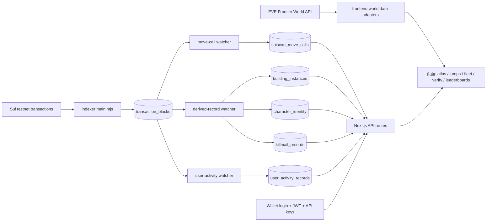
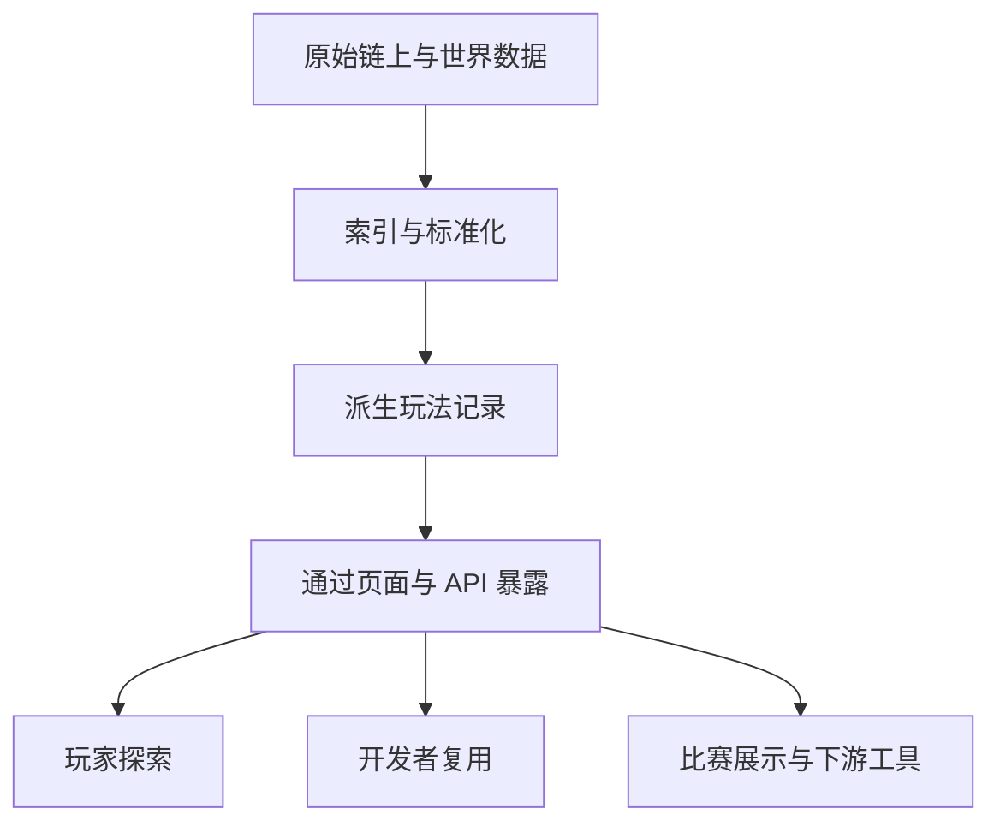

# EVE EYES

EVE EYES 是一个面向 EVE Frontier 生态的开源链上情报控制台。它把原始 Sui 链上行为与 World API 数据，整理成玩家、开发者与参赛团队都能直接使用的产品界面与数据能力，包括世界探索、路线情报、可验证数据卡片、钱包登录和可复用 API。

[Live Product](https://eve-eyes.d0v.xyz/)

[English Version](./README.md)

## 产品定位

EVE EYES 是一个面向 EVE Frontier 的链上游戏数据索引器与情报层。

它位于“原始链上行为”和“下游游戏产品”之间。我们不要求团队从交易开始自己解析状态、推导事件、再单独做查询能力，而是把链上活动整理成结构化玩法数据、可操作界面和可复用 API。

一句话概括：

> EVE EYES 是一个面向 EVE Frontier 的比赛级链上游戏数据索引器、情报控制台与 API 层。

## 我们解决了什么需求

很多链游项目都会遇到同一个瓶颈：

- 数据虽然公开，但很难直接用于产品
- 原始交易虽然可见，但大多数人无法高效理解
- Hackathon 团队常把大量时间耗在数据清洗，而不是创意实现
- 很多 demo 停留在展示层，没有形成可复用的基础设施

EVE EYES 解决的是这层“从链上数据到可用产品”的落差。它把原始链上活动转成了带 UI、带索引存储、带派生记录、带 API 的完整产品。

玩家、设计者和开发者真正需要的不是原始链上日志，而是可行动的信息：

- 我可以去哪里？
- 世界里最近发生了什么？
- 谁拥有了什么？
- 建筑、角色、战斗这些状态怎么被感知？
- 数据是否可信，是否可以传播和分享？

EVE EYES 用以下方式回答这些需求：

- 路线规划与 Atlas 世界探索
- 已索引交易与 Move Call 查询
- 建筑排行榜、角色身份、Killmail 等派生玩法数据
- POD 验证与可分享卡片
- 钱包登录、JWT、API Key 和开放 API

## 我们采用了什么方式

EVE EYES 把三层能力做成一个统一产品：

- 体验层：有世界观氛围的操作控制台，用于探索、检索和访问管理
- 数据层：索引器持续抓取 Sui 包相关交易，并整理进 PostgreSQL
- 复用层：通过 HTTP API、钱包登录、JWT 与 API Key，把数据开放给其他工具和作品

这使得它同时具备三层价值：

- 作为玩家可直接使用的情报产品
- 作为链上游戏数据基础设施
- 作为其他团队可以继续搭建产品的底座

## 为什么它适合比赛

- 需求真实：解决的是原始链上数据难以直接转化为玩法功能的问题
- 闭环完整：不只展示页面，还包括采集、解析、派生、存储、查询、认证与复用
- 主题契合：整体体验更像游戏内指挥台，而不是普通后台
- 可扩展：多个项目都可以继续基于它的 API 和数据表构建功能
- 可证明执行力：已有在线产品、索引流程、派生数据和下游使用场景

## 核心能力

- 将包相关的 Sui 交易持续索引到 PostgreSQL
- 解析 Move Calls，并提供交易级详情页与 API
- 生成更高层的玩法数据，如建筑归属、角色身份、Killmail、用户活动记录
- 探索世界数据，包括星系、星座、部族、舰船和路线
- 验证 POD 数据并生成可分享的系统卡片
- 支持钱包登录、JWT 会话与 API Key 管理
- 提供公开与鉴权 API，便于面板、机器人、分析工具和比赛作品接入

## 覆盖的用户需求

### 开发者 / 参赛团队

- 需要尽快拿到结构化数据
- 需要文档化 API
- 需要登录和密钥机制来支持自动化调用

### 玩家 / 指挥者 / 观察者

- 需要路线与世界情报
- 需要可读的链上活动记录
- 需要验证能力和信任信号

### 生态 / 下游开发者

- 需要稳定的索引数据层，而不是每次都重新解析链上行为
- 需要更贴近玩法语义的高层记录
- 需要能同时支撑多个产品的基础设施

## 技术架构

### Monorepo 结构

- `packages/frontend`
  - Next.js 应用
  - 前端界面、API 路由、认证流程、数据库查询层
- `packages/indexer`
  - 长驻 Node.js Worker
  - 交易抓取、Move Call 解析、派生记录同步、用户活动同步
- `packages/backend`
  - 早期保留的 Move 包脚手架

### 系统架构图



### 产品数据流



## 为什么它更像一个真实产品

- 原始事实表与业务派生表分层清晰
- 索引流程可重复执行，具备幂等性
- 前端体验与 API 访问在同一产品内打通
- 具备钱包认证与 API Key 流程，能被外部真实消费
- 世界数据不仅展示，还强调可验证与可分享

这不是一个只看起来“像产品”的页面，而是一个正在运行的链游数据产品与索引基础设施。

## 当前已经具备的产品面

- `/atlas`：世界地图与星门连接探索
- `/jumps`：路线与访问控制相关能力
- `/fleet`、`/codex`、`/tribes`：世界实体检索与浏览
- `/leaderboards`：观察到的建筑持有排行榜
- `/verify`：POD 验证与可分享系统卡片
- `/indexer/*`：交易、Move Call、角色等索引数据检索
- `/access`：登录、JWT / API Key、API Explorer

## 本地运行

在仓库根目录执行：

```bash
pnpm install
pnpm dev
```

## Indexer 运行方式

如果希望索引数据持续更新，仅运行原始抓取还不够。主进程会先写入交易块，后续还需要 watcher 把更高层的数据表同步出来。

通常需要：

- 保持 `packages/indexer/src/main.mjs` 持续运行，用于抓取原始交易
- 运行 `db:watch:derived-records`，同步建筑、角色、Killmail 等派生记录
- 运行 `db:watch:user-activities`，同步用户活动时间线
- 如果希望 `suiscan_move_calls` 保持最新，再运行 `db:watch:transaction-block-move-calls`

更详细的说明见 [packages/indexer/README.md](./packages/indexer/README.md)。

## 适用场景

- 需要可直接使用链游数据的 Hackathon 作品
- 游戏数据面板、世界情报工具、社区分析站
- 围绕路线、建筑、战斗行为的自动化或可视化工具
- 需要公开或鉴权 API 的机器人和数据流程
- 基于击杀、建筑、持仓等链上事件触发奖励的系统
- 基于阶段性目标发放 NFT 或成就的领取系统
- 生态展示场景中，希望交付一个可操作产品，而不是浏览器截图

## 下游构建示例

因为 EVE EYES 暴露的是结构化玩法记录，而不是原始交易，所以其他项目可以直接在它之上编写游戏逻辑。

例如：

- 玩家完成一次符合条件的击杀后，可以直接触发特定奖励的领取资格
- 玩家达成一定的星舰数量目标后，可以领取对应 NFT
- 社区产品可以直接做建筑、战斗、角色活动面板，而不必再维护自己的链解析流程
- 任务、徽章、赛季活动等系统，可以直接基于索引后的链上事件驱动

这很重要，因为项目价值不只来自 EVE EYES 自己的界面，而是来自它作为共享数据底座，已经能够支持更多玩法和更多产品继续生长。

## 开源协议

- 代码采用 [MIT](./LICENSE)
- 图形与视觉资源说明见 [LICENSE-GRAPHICS](./LICENSE-GRAPHICS)

## 当前状态

EVE EYES 目前已经具备：

- 在线部署版本
- 可运行的索引与派生流程
- 钱包访问与认证能力
- 可复用 API
- 持续扩展中的玩法数据集
